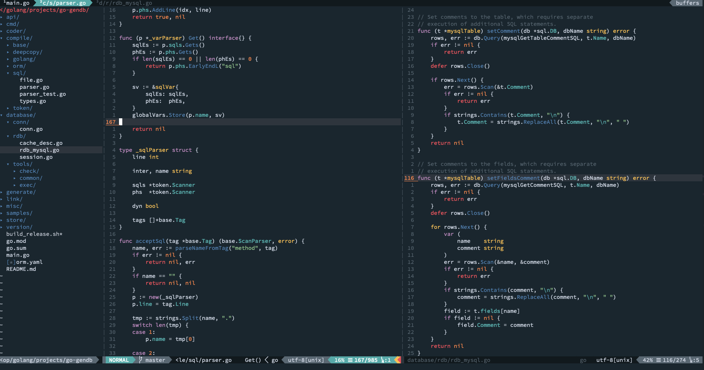
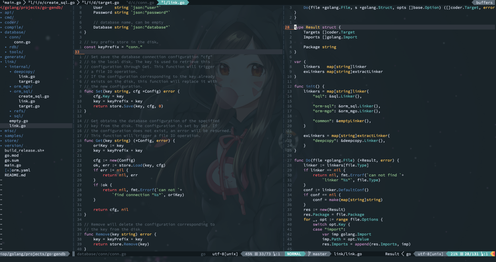

# Oceanic-Next.vim

This theme is a personal custom edition for [mhartington/oceanic-next](https://github.com/mhartington/oceanic-next). I changed some color details to match my own aesthetics and habits.

## Installation

All major plugin managers for vim/nvim are supported

For vim(equal or above 8) or neovim, add the following to your `.vimrc`.

 ```vim
set termguicolors
colorscheme OceanicNext
 ```

If your terminal has transparancy, you can enable it by adding the
following lines to your vimrc **after** calling `colorscheme OceanicNext`:

```viml
hi Normal guibg=NONE ctermbg=NONE
hi LineNr guibg=NONE ctermbg=NONE
hi SignColumn guibg=NONE ctermbg=NONE
hi EndOfBuffer guibg=NONE ctermbg=NONE
```

## Screenshot

non-transparent:



transparent:


